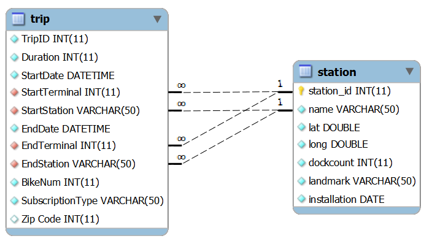

# Bay Area Bike Sharing (BABS) dataset

Data-set di esempio per il corso di Tecniche di Programmazione, che contiene dei dati relativi ai tragitti del servizio di Bike Sharing nella Bay Area (San Francisco e dintorni).

I dati sono stati tratti da una _challenge_ pubblica, disponibile all'indirizzo <https://www.bayareabikeshare.com/datachallenge> (ora non più funzionante).

Struttura del database:

